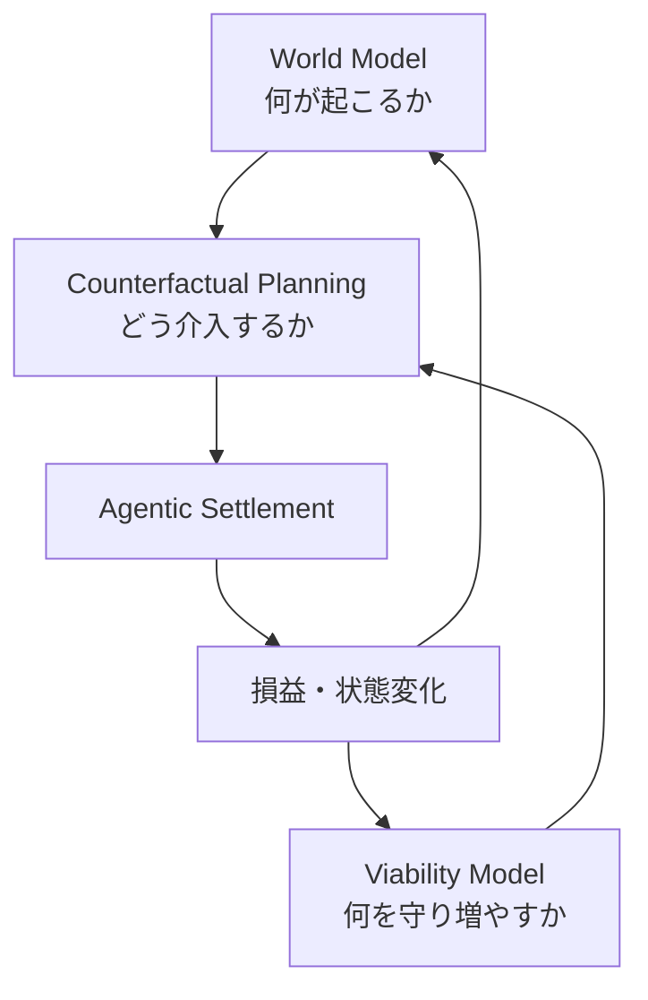

# 1.concept — コンセプト概要

> **テーマ**: dodo Crypto Wealth OS / **theme_id**: `crypto-wealth-os` / **profile**: `crypto` / **作成**: 2026-08-22
> **標準**: [`README.md`（コンセプト設計標準）](README.md) に従う。問いは3つ前後に収束させる。
> **インプット正本**: [`../5.reference/crypto.md`](../5.reference/crypto.md)

## 大原則（Prime Directive）

> **不可逆的な損失を避けながら、将来取り得る選択肢（介入可能性）を最大化する。**

利益最大化はこの下位概念である。資本を増やすのは、次に取れる Action を増やすため。逆に最大のリスクは価格変動ではなく、**二度と次の Action を取れなくなること**である。

形式的には、生存制約下での幾何平均成長と Optionality 最大化として表現する:

```text
max_π  E[ Δlog W + α·ΔΩ + β·IG ]
subject to  P(ruin) < ε
```

- **W**: 資本（金銭的資本）
- **Ω**: 将来実行可能な Action 集合（Optionality — 流動性・権限・Protocol access・実験可能性を含む）
- **IG**: 情報利得（新しい知識・モデル精度・確度校正の改善）
- **ruin**: 回復不能な破綻（資本・鍵・権利・流動性の不可逆な喪失）

これにより「資本を増やす」「流動性を残す」「新しい知識を得る」「一撃で死なない」を単一の原則で同時に扱う。

セキュリティ侵害（鍵流出・権限奪取・任意 calldata 署名）は ruin の具体形であり、**P(ruin) < ε はゼロトラスト設計を内包する** — セキュリティとリスク管理は別章ではなく同一の目的関数に統合される。

## AI 統治の試金石（Why This Theme — dodoAI 防衛グレードとの関係）

本テーマは crypto アプリの開発であると同時に、**dodoAI の Agent 統治（防衛グレード）を最も過酷な環境で検証する試金石**である。

- **クリプトはゼロトラストが前提の環境**: 取引は不可逆・相手は匿名・コントラクトは敵対的・情報源は汚染済み（プロンプトインジェクション / 偽サイト / 偽トークン）・失敗は即座に定量化される。ここで壊れない Agent 統治は、あらゆるドメインで壊れない
- **我々はチェーン（実行層）をやるのではない**: Swap Routing・Lending calldata・チェーン基盤は外部レイヤーに委任する（→ [07-why-not-simple.md](07-why-not-simple.md) §4）。ただし **Wallet（Signer / 鍵管理 / Policy Enforcement）は dodoAI 自身のもの（dodo-wallet + dodo クレデンシャル機構、CR-1 の二層構成）を使う** — 鍵と権限の統治は防衛グレードの中核であり外部に渡さない。本テーマが作るのは **リスクレベルを評価し、HIL を必須とする統治層**であり、これは dodoAI 本体の Gate / Capability Routing / HIL 機構の直接応用である
- **統治の各機構がここで実地検証される**: 鍵の分離統治（Agent 自身をゼロトラスト対象とする）・決定論的 Policy Engine（LLM が乗っ取られても実害に至らない多層防御）・Session Key 失効 / Kill Switch（blast radius の限定）・Evidence 追記のみ（改ざん不能な監査線）・Guardian 停止フロー（自動インシデントレスポンス）
- **実資産を賭けても壊れない統治**を実証できれば、それは dodoAI の防衛グレードの最強の Evidence となり、ここで鍛えた Gate・不可逆性管理・インシデント対応は dodoAI 本体の Agent 統治機構へ還流する

## ひとことで言うと

「AIに相場を当てさせるアプリ」ではなく、**World Model（何が起こり得るか）と Viability Model（どの未来なら生存でき選択肢が増えるか）の差分から介入機会を発見し、生存制約下で Agentic Settlement（契約・署名・決済）を積み重ねるパーソナル AI 資産形成 OS**。資産（秘密鍵）はユーザーが持ち、Agent は期限付き・用途限定の権限と決定論的なポリシーエンジンに拘束される — **Non-custodial, policy-custodied autonomy**。

## 三要素アーキテクチャ

発想（Opportunity）は独立した魔法の Creative Agent が持つのではなく、**World Model が予測する「可能な未来」と、Viability Model が求める「望ましい未来」の差分から発生する**。



| # | 要素 | 役割 |
|---|---|---|
| 1 | **World Model** | 何が起こり得るかを予測する。単一予測値ではなく、各未来の確率分布 × 損益分布 × 不可逆性を推定する。実体経済の Digital Twin ではなく、Crypto 市場へ因果的に流入する境界変数だけを残した **Minimal Causal World Model**（→ [../2.sdt-design/02-data-model.md](../2.sdt-design/02-data-model.md)） |
| 2 | **Viability / Value Model** | どの未来なら生存でき、選択肢が増えるかを評価する。Ruin 確率の上限管理・不可逆性の最小化・Optionality（Ω）の蓄積を司る |
| 3 | **Agentic Settlement** | 選択した介入を実際に契約・署名・決済する。決定論的な Policy Engine と Gate に拘束される（→ [05-multi-agent.md](05-multi-agent.md)、CR-1〜3） |

## リスクの再定義

リスクとは価格変動ではなく、**将来の意思決定能力を失うこと**である。したがってボラティリティではなく、**不可逆性を最小化**する。

| 本当のリスク（不可逆性） | 悪いリスクとは限らない例 |
|---|---|
| レバレッジによる強制清算 / 資金ロック / Bridge 停止 / 秘密鍵流出 / 単一 Protocol への集中 / 同じ担保への見えない相関 / 税務負債 / 流動性枯渇 / モデルが理解できない Contract | 価格変動が大きくても、無借金・十分な流動性・損失上限が明確・長期間保有可能・Upside が非対称であるもの |

## 根底に置く4つの仮説

| # | 仮説 | 要旨 |
|---|---|---|
| **H-1 Survival Premium** | 破綻しなかった資本だけが次の大きな機会を取れる。暴落時に Liquidity を持つ者は平常時の数年分を一度で稼げる。常に全資本を最適配置するのではなく、**行動可能性の保有自体に価値がある** |
| **H-2 Constraint Alpha** | 収益機会は情報差より、**他者が動かざるを得ない地点**に発生する（清算・Unlock・Incentive 終了・償還期限・Governance 変更・資本規制・Collateral 不足）。これらの予測は単純な価格予測より構造的 |
| **H-3 Convexity** | 正解率より Payoff 構造が重要。10回中7回当てても一度の損失で全てを失えば無意味。損失1・利益10・成功確率20%なら期待値は正になり得る。World Model は「上がる確率」ではなく **確率分布 × 損益分布 × 不可逆性** を推定する |
| **H-4 Reflexivity** | Agent の予測が行動になり、行動が市場を変える。皆が同じモデルで同じ Protocol へ移動・同じ価格で Stop・同じ Risk-off をすれば、モデル自身が危機を作る。World Model は「他 Agent が何を予測しているか」「同じ Policy の混雑度」を含む |

## Product Form（基本方針）

本プロジェクトは **single-owner / local-first のパーソナル dodo Custom App** として作る。dodoAI の personal scope（`.dodoai/personal/custom_ui/` + `.dodoai/personal/custom_actions/`）を使い、本人の Portfolio / Policy / Wallet / Evidence と日々の運用ループに最適化する。

| 項目 | 方針 |
|---|---|
| 一次利用者 | 資産所有者であり最終承認者でもあるユーザー本人 |
| 提供形態 | dodoAI に統合する Personal Custom UI + Personal Custom Action。standalone の汎用 SaaS を既定にしない |
| データ境界 | local-first。秘密鍵・シードは Agent / サーバー / repository / SDT に渡さず、CR-1 の二層鍵管理を使う |
| 個別最適 | 本人の投資方針・Wallet 構成・RiskBudget・観測対象・承認閾値に合わせる |
| 既定スコープ外 | multi-user、public SaaS、hosted custody、顧客アカウント、組織承認、第三者向け商用化 |
| 拡張条件 | 既定スコープ外へ広げる前に HIL を行い、Concept と A02 要件セットを更新する |

## プロジェクトタイプ（ルート README §1.1 から選ぶ）

| 項目 | 値 |
|---|---|
| タイプ | **A 戦略・仮説検証型 + E モニタリング型** の組み合わせ |
| 選定理由 | Opportunity（World Model と Viability Model の差分から生成される介入仮説）は「前提条件つき仮説」として管理し外部変化で検証する（A）。同時に、生存制約（P(ruin) < ε）・Policy（投資憲法）・目標配分という正本と、オンチェーン実態（残高・Approval・不可逆性エクスポージャ）との差分を常時監視し、DRIFTED を検知して是正する（E）。価格予測は主役にしない |
| データモデルの起点 | A=World Model の予測分布と Viability Model の要求の差分（介入仮説）＋ 外部変化 / E=正本（Policy・生存制約・目標配分）＋ 実態観測（ウォレット・ポジション・不可逆性・Constraint シグナル） |

## 課題（Before）→ 変わること（After）

| Before | After |
|---|---|
| 損失最小化だけを目指すと最適解が「何もしない・現金で持つ」に退化し、期待収益だけを最大化するとレバレッジと Tail Risk 無視で破綻する | **生存制約下での幾何平均成長 + Optionality 最大化**という単一原則で、資本増加・流動性維持・知識獲得・破綻回避を同時に扱う |
| リスクを価格変動（ボラティリティ）として管理し、清算・資金ロック・鍵流出・見えない相関という不可逆リスクが管理されない | リスク＝**将来の意思決定能力の喪失**と定義し、不可逆性を第一のリスク軸として機械管理する |
| ファンダ・テクニカルの2軸しか見ず、「誰が・いつ・なぜ動かざるを得ないか」（制約の非対称性）を捉えられない | **Positioning / Constraints を第三の分析軸**として Constraint Graph を構築し、他者の強制行動地点に機会を探す |
| 数百プロトコルの巡回・期限管理・Claim・Approval 解除を人間が継続できず、機会を取りこぼす | Agent が 24 時間クロール・期限管理・Claim 検知を行い、オペレーショナルαを取りこぼさない |
| 従来の自動売買は API キー丸渡しのブラックボックス。売買回転が増えて手数料・ノイズで負ける | 権限は期限付き・用途限定。デフォルトは「何もしない」。No-action との Counterfactual 比較を常に行う |
| なぜ投資したか・どの情報源が正しかったかが残らず、失敗から学べない | 全判断を Evidence Ledger に記録し、情報利得（IG）と介入の増分利益を「何もしない場合」と比較測定する |
| 危険（デペッグ・脆弱性・Admin key 変更）への退避が人間の気づき頼み | Guardian Agent が不可逆性シグナルを検知 → 新規取引停止 → 権限停止 → 退避案 → 人間へ緊急承認まで自動化 |

## このテーマが答える問い（3つ前後に絞る）

> 1. **この介入は生存制約下でプラスか** — 各介入候補は、確率分布 × 損益分布 × 不可逆性で評価して正の Convexity を持つか。No-action との Counterfactual 比較でも優位か。P(ruin) < ε を維持したまま Δlog W + αΔΩ + βIG を改善するか。
> 2. **制約の非対称性を捉えているか** — 「誰が・いつ・なぜ動かざるを得ないか」（清算・Unlock・償還・Governance 期限）を Constraint Graph として構造化し、他者の強制行動から機会を発見できているか。同じモデルの混雑（Reflexivity）を検知できているか。
> 3. **介入可能性（Ω）は増えているか、そして権限とポリシーは常に守られているか** — 資本・流動性・知識・権限・Protocol access を含む Action 集合が蓄積されているか。秘密鍵非保持・金額上限・Allowlist・回転数上限・損失限度・権限失効という投資憲法が全実行で機械的に検査され、逸脱ゼロを証明できるか。

## HIL（Human-in-the-Loop）ゲート

| # | フェーズ | 人間が判断すること | 状態 |
|---|---|---|---|
| H0 | Product Form | パーソナル dodo Custom App を基本方針とするか | ✅ 承認（2026-08-22） |
| H1 | コンセプト・データモデル確定後 | この構造（生存原理・三要素アーキテクチャ・4仮説）で進めてよいか | ⬜ 再承認待ち（v0.5 根本改訂のため差し戻し） |
| H2 | データ初期投入後 | Policy・生存制約（ε）・目標配分・Allowlist・観測ソースが実態と一致しているか | — |
| H3 | 評価・レビュー後 | Opportunity 評価・不可逆性判定・Constraint Graph を採用するか | — |
| H4 | 重要な判断が必要なとき | 実行承認（Approve 段階の全取引 / Autopilot 段階の閾値超過取引・緊急退避 / 不可逆性の高い全 Action） | — |

---

## 改版履歴

| バージョン | 日付 | 内容 |
|---|---|---|
| v0.5.2 | 2026-08-22 | Wallet の扱いを訂正: 外部委任ではなく dodoAI 自身の dodo-wallet + dodo クレデンシャル機構（CR-1 二層構成）を使うことを明記 |
| v0.5.1 | 2026-08-22 | 「AI 統治の試金石」節を追加: ゼロトラスト・クリプトを dodoAI 防衛グレードの検証環境と位置づけ、チェーン（実行層）はやらず「リスクレベル評価 + HIL 必須」の統治層に集中することを明記。P(ruin) < ε がゼロトラスト設計を内包することを追記 |
| v0.5.0 | 2026-08-22 | **根本改訂**: 大原則（生存制約下での幾何平均成長 + Optionality 最大化）を最上位に置き、三要素アーキテクチャ（World Model / Viability Model / Agentic Settlement）・リスク再定義（不可逆性）・4仮説（Survival Premium / Constraint Alpha / Convexity / Reflexivity）を導入。答える問いを再定式化。H1 を再承認待ちへ差し戻し |
| v0.4.0 | 2026-08-22 | single-owner / local-first のパーソナル dodo Custom App を Product Form の基本方針として追加（H0 承認） |
| v0.3.0 | 2026-08-22 | crypto.md（5.reference）を元にテーマ固有内容を記入 |
| v0.2.0 | {{DATE}} | 汎用化: プロジェクトタイプ選択セクションを追加 |
| v0.1.0 | {{DATE}} | 雛形から生成（未記入） |
