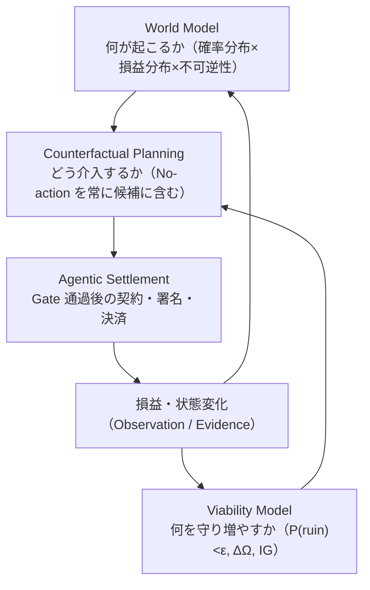

# 03 — アプローチ（Approach）

> **テーマ**: dodo Crypto Wealth OS / **theme_id**: `crypto-wealth-os` / **profile**: `crypto` / **作成**: 2026-08-22
> **標準**: [`README.md`（コンセプト設計標準）](README.md) の品質バーに従う。運用ループが閉じていること（観測→評価→更新→観測）。
> **上位原理**: [`00-overview.md`](00-overview.md) の三要素アーキテクチャ（World Model / Viability Model / Agentic Settlement）を運用ループとして実装する。

## 中核ループ（三要素の閉ループ）



- **発想は差分から生まれる**: Opportunity（介入仮説）は独立した Creative Agent の産物ではなく、World Model の「可能な未来」と Viability Model の「望ましい未来」の差分として機械的に発生する
- **No-action は常に候補**: Counterfactual Planning は「取引しない場合」を必ず比較対象に含め、優位が示せない介入は棄却する
- **両モデルへの学習フィードバック**: 損益・状態変化は World Model（予測校正）と Viability Model（Ω・ruin 距離の実測）の両方へ戻る。これが情報利得（IG）の獲得経路

## 全体フロー（OODA ループエンジニアリング × WF 実行モデル）

> **原則**: 本テーマの運用は直列のフェーズ消化ではなく、**dodoAI のループエンジニアリング（OODA）を WF（TaskGraph 埋め込みの標準 Workflow）で回し続けること**である。各周回は WF として dispatch され、結果は SDT へ書き戻される（WM-4: dispatch と observe の対）。フェーズは「ループを回せる状態を作る整備順」として位置づけ直す。

```text
Phase 0  Concept       → 1.concept/                  ← 今ここ（v0.5 根本改訂・H1 再承認待ち）
Phase 1  Preparation   → 2.manual/00.preparation/    オントロジー定義・カタログ雛形・MCP 接続
                                                     ＋ 運用ループ WF の登録（workflow.catalog_upsert — 下記 §運用ループの WF 写像）
Phase 2  Structuring   → 2.manual/01.structuring/    初期データ投入（Policy・生存制約 ε・Wallet・Allowlist・境界変数・観測ソース）
Phase 3  Loop Run      → 99.sdt/art/ + agn/          運用ループ WF の継続実行。カタログ正本＋Evidence の継続生成（SDT JSON = SoT）
Phase 4  Loop Eval     → 99.sdt/art/ + MD view       評価もループの一部として WF 実行。評価成果物は SDT(JSON)+MD の双対で保持（下記 §評価成果物の双対表現）・HIL ゲート統治
```

- Phase 3/4 は「終わるフェーズ」ではなく**定常運転**。Phase 4 の評価は Phase 3 の観測へ再入力される（ループが閉じる要）
- WF 自体も評価対象にする: `workflow.effectiveness_eval` で標準 WF の遵守率・効率を測定し、WF 定義を改訂する（ループのループ）
- 現状の負債: 標準 WF カタログ（`docs/99.sdt/agn/1.workflows/_standard/workflows.catalog.json`）は未生成（`F-WORKSPACE-BOOTSTRAP` running）。Phase 1 の成果物として解消する

プロダクトとしての自律度は 3 段階で拡張する（信頼の段階的獲得）。段階は **Agentic Settlement 層の自律度**であり、World Model / Viability Model の観測・評価は Stage 1 から全開で回す:

```text
Stage 1  Observe   分析と提案だけ（実行しない）— W.M. と V.M. の校正期間
Stage 2  Approve   人間承認後に執行
Stage 3  Autopilot 限定された範囲だけ自律執行（Policy・回転数・Canary・不可逆性上限の枠内）
```

機能の実装順は**不可逆性の低い順**に積む: ①資産・ポジション統合表示（W の Fact 化） → ②境界変数・Constraint Graph の観測開始（W.M. 構築） → ③Opportunity 生成・Convexity 評価 → ④リスク・不可逆性シグナル検知（Guardian） → ⑤Airdrop / Claim / 期限管理 → ⑥Lending / Staking 比較 → ⑦人間承認による実行 → ⑧限定自律実行 → ⑨リバランス / DCA → ⑩LP / Borrow / デルタニュートラル → ⑪最後に少額の方向性トレーディング（不可逆性は低いが Convexity 立証が最難）。

## 実装順 → ADF 要件アーキテクチャへの写像（EPIC / CAP）

実装順①〜⑪は概念的原理であり、実際の開発は **ADF 要件アーキテクチャ**（縦糸 `BR → SR → UC` / 横糸 `CAP ─owns→ FR`）に写像して進める。**EPIC / CAP / FR の正本カタログは [`../4.common/3.capability-requirements/00-capability-requirements.md`](../4.common/3.capability-requirements/00-capability-requirements.md)**（JSON-first: AGN catalog ノード。新設・変更は HIL 裁定必須）、優先度キューは [`../3.strategy/01-implementation-priority.md`](../3.strategy/01-implementation-priority.md) が所有する:

| 実装順 | EPIC | Feature | 主要 CAP |
|---|---|---|---|
| ① 統合表示 | EPIC-VIABILITY | `F-CRYPTO-PORTFOLIO-DASHBOARD` | CAP-ONCHAIN-OBSERVE, CAP-VIABILITY-EVAL |
| S1 Viability 正本 | EPIC-VIABILITY | `F-VIABILITY-POLICY-CORE` | CAP-VIABILITY-EVAL, CAP-POLICY-ENGINE |
| ② 境界変数・Constraint 観測 | EPIC-WORLD-MODEL | `F-WORLD-MODEL-OBSERVE` | CAP-ONCHAIN-OBSERVE, CAP-RISK-DETECT |
| ③ Opportunity・Convexity | EPIC-OPPORTUNITY | `F-OPPORTUNITY-ENGINE` | CAP-OPPORTUNITY-GEN, CAP-VIABILITY-EVAL |
| ④ RiskSignal（Guardian） | EPIC-GUARDIAN | `F-GUARDIAN-RISKSIGNAL` | CAP-RISK-DETECT, CAP-POLICY-ENGINE |
| ⑤ Airdrop / Claim | EPIC-OPPORTUNITY | `F-AIRDROP-CLAIM-TRACKER` | CAP-OPPORTUNITY-GEN |
| ⑥ Lending / Staking 比較 | EPIC-OPPORTUNITY | `F-YIELD-COMPARE` | CAP-OPPORTUNITY-GEN |
| ⑦ 人間承認つき実行 | EPIC-SETTLEMENT | `F-EXECUTION-APPROVE` | CAP-EXEC-PIPELINE, CAP-KEY-CUSTODY（= dodo-wallet 統合のみ） |
| ⑧〜⑪ 限定自律〜 | EPIC-SETTLEMENT | （後日 A02 — 凍結） | CAP-EXEC-PIPELINE 他 |

- CAP-EVIDENCE-LEDGER は全 Feature 横断（Evidence / IG 測定の共通能力）
- 新しい実装順・Feature を追加するときは、先に所有 EPIC / CAP を catalog で確認し、無ければ HIL で定義する（A02 Step 0 — HARD）

## 運用ループ（閉じていること）

```text
① 観測 → ② 差分検知 → ③ 評価 → ④ 意思決定支援 → ⑤ HIL → ⑥ 成果物更新 → ①へ戻る
```

| ステップ | 三要素 | 入力 | 出力 | 確度 |
|---|---|---|---|---|
| ① 観測 | World Model / Viability Model | オンチェーン実測（残高・Approval・価格）、境界変数（ドル流動性・金利・Stablecoin 供給・Unlock 等）、Constraint シグナル（清算水準・償還期限・Governance 日程）、混雑度（Reflexivity） | World Model の状態・分布更新、Viability 空間の Fact 更新（W・Ω・ruin 距離） | Fact（オンチェーン実測）〜 Belief（クロール情報・分布推定） |
| ② 差分検知 | W.M. × V.M. の差分 | World Model の予測分布と Viability Model の要求（生存制約・目標配分・Ω 目標） | 介入仮説（Opportunity）候補、配分乖離（DRIFTED）、不可逆性兆候、Constraint イベント予告 | 決定論的（閾値判定）＋ Belief（分布差分） |
| ③ 評価 | Counterfactual Planning | 介入仮説候補 ＋ Source 信頼度 | Convexity 評価（確率分布 × 損益分布 × 不可逆性）、No-action との Counterfactual 比較、Fractional Kelly によるサイズ制限、Risk/Red Agent による反証、混雑度チェック | Belief（confidence 付き・校正実績で較正） |
| ④ 意思決定支援 | Settlement 前検査 | 評価済み Opportunity / RiskSignal | 実行案（Execution 候補）または「何もしない」判定 ＋ 根拠 Evidence。Policy Gate・Irreversibility Gate・Simulation Gate の事前検査結果 | 決定論的検査 + Belief |
| ⑤ HIL | Settlement 承認 | 実行案 ＋ Gate 検査結果 | 人間の承認/却下（Observe/Approve 段階は全件。Autopilot 段階は閾値超過・不可逆性高・緊急退避のみ） | 人間判断 |
| ⑥ 成果物更新 | 両モデルへの学習 | 承認済み実行の結果（Observation） | Position・Evidence Ledger・W/Ω/ruin 距離の実測更新・予測校正（forecast error）・Source 信頼度・StrategyVersion 実績の更新 → 次の①の観測対象になる | Fact |

ループが閉じる要: ⑥で記録した Evidence と実績が、①の観測対象（予測校正・Ω 実測・Source 信頼度・StrategyVersion 実績）として再入力され、**World Model の校正度（IG）と介入の増分利益（対 No-action）が継続的に較正される**。

## 運用ループの WF 写像（OODA × dodoAI 実行機構）

運用ループ①〜⑥は概念図で終わらせず、**dodoAI の WF（TaskGraph 埋め込みの標準 Workflow）として登録・dispatch する**。各ステップは OODA へ写像され、実行面（WF / Action / Gate / 書き戻し先）を必ず持つ:

| ステップ | OODA | 実行面（WF / Action） | 書き戻し先（SDT） |
|---|---|---|---|
| ① 観測 | Observe | 観測系 Custom Action（snapshot / price_tick / 境界変数・Constraint 観測）を WF ノードとして定期 dispatch | World Model 空間 / Viability 空間の Fact・分布更新（SDT Action 経由。JSON 直編集禁止） |
| ② 差分検知 | Orient | DRIFTED 検知・差分生成 Action（決定論的閾値判定） | Opportunity 候補ノード（`derives_from` 付き） |
| ③ 評価 | Orient | Convexity 評価・Counterfactual 比較・Fractional Kelly サイズ算出 Action ＋ Multi-Agent レビュー（Risk / Red） | 評価結果 = **SDT(JSON)+MD の双対**（下記 §評価成果物の双対表現） |
| ④ 意思決定支援 | Decide | Gate 検査 Action 群（Policy / Viability / Irreversibility / No-action / Sizing / Crowding — 05 参照）。最終可否は決定論的 Policy Engine | Gate 判定結果を Evidence へ追記 |
| ⑤ HIL | Decide | 本体 HIL 機構（staging approve / HIL Gate）。人間承認まで SoT に結論を書かない | 承認/却下の記録（Evidence） |
| ⑥ 成果物更新 | Act | Execution（Approve 段階以降）または提案のみ（Observe 段階）＋ Auditor の較正 Action | Position・Evidence Ledger・StrategyVersion 実績・forecast error（Intervention/Observation の対 — WM-4） |

**WF 運用の規律**:

- 運用ループ WF（候補: `wf-observe-loop` / `wf-evaluate-loop` / `wf-guardian-watch` / `wf-calibration-weekly`）は `workflow.catalog_upsert` で標準 WF として登録し、`workflow.catalog_list` から選定する。アドホック実行を定常運転にしない
- WF の各周回は TaskGraph ノードとして状態（ready/running/done/failed）を持ち、dispatch と observe を対で記録する（WM-4）。ループの一次状態は TaskGraph、人間可読 view は Issue/MD（P29 と同型）
- WF 自体の評価は `workflow.effectiveness_eval`（遵守率・効率・精度）で行い、WF 定義の改訂へ接続する（ループのループ）

## 評価成果物の双対表現（SDT + MD — HARD）

**評価は SDT 化と MD のセットにしないとループとしてワークしない。** 評価成果物（Convexity 評価・Gate 判定・予測校正 forecast error・増分利益・ΔΩ・IG・Canary 昇格判定）は、次の双対で保持する（WM-5）:

| 側 | 置き場 | 性質 |
|---|---|---|
| **JSON（機械可読 SoT）** | `docs/99.sdt/art/` 配下（Evidence / StrategyVersion / 評価レコード）。読み書きは必ず SDT Action 経由（直読み・直編集禁止） | 次周回の①観測の入力になる正本。Fact / Belief / Hypothesis を分離して保持（WM-3） |
| **MD（人間可読 view）** | 評価レポート・Issue view（`md_ref` で JSON と対応付け） | HIL 判断・レビューの面。MD 単独の構造更新をしない |

- **MD だけの評価レポート・JSON だけの評価記録は、どちらも「評価未完了」と扱う**（片肺禁止）
- 評価結果は [`../2.sdt-design/02-data-model.md`](../2.sdt-design/02-data-model.md) の Evidence ノードへ追記（追記のみ・改変禁止）、較正実績は StrategyVersion へ反映する — これにより評価が機械的に次周回の観測対象となり、ループが閉じる
- 評価の数値（forecast error・counterfactual_return・ΔΩ 等）を MD へ転記して正本化しない。MD には取得 Action / 参照を書く

## 運用原則（大原則から導かれる 8 箇条）

| # | 原則 | 実装先 |
|---|---|---|
| 1 | **生存を最優先する** — Ruin 確率を上限管理する（P(ruin) < ε） | Viability Model / RiskBudget / Guardian |
| 2 | **不可逆損失を避ける** — 流動性・秘密鍵・権利・資本を失う Action を厳しく扱う | Irreversibility Gate / CR-1 / CR-9 |
| 3 | **確度ではなく分布で考える** — 単一予測値を使わない | World Model の全ノード（分布必須） |
| 4 | **資金量は確信度ではなく不確実性で制限する** — Fractional Kelly 的に Size を決める | Counterfactual Planning / Policy Gate |
| 5 | **異なる Token ではなく異なる因果へ分散する** — 同じ Stablecoin・Bridge・Oracle なら見かけ上の分散にすぎない | Viability 空間の相関不変条件 |
| 6 | **他者の強制行動を探す** — Constraint Graph を構築する | World Model / Constraint Graph |
| 7 | **常に No-action を候補に含める** — 取引しない場合との Counterfactual 比較を行う | No-action Counterfactual Gate |
| 8 | **将来の Action を増やす** — 利益・流動性・知識・権限・Protocol access を蓄積する | Ω の実測・Evidence Ledger / IG 測定 |

## ステップ分解

| Step | 内容 | 入力 | 出力 | 確度 |
|---|---|---|---|---|
| S1 | Viability Model の初期定義: Policy（投資憲法）・生存制約 ε・Wallet 分離・RiskBudget（= ruin 制約の配分）・Ω の初期棚卸し | ユーザーの投資方針（自然言語） | 機械実行可能な Policy、Vault/Earn/Explore/Trade の Wallet 構成、ε と不可逆性上限 | HIL 確定 |
| S2 | World Model の観測基盤: 境界変数（Minimal Causal World Model）・Constraint シグナル・観測ソースの登録と信頼度階層の設定 | 04 §観測の表 | 境界変数ノード群・Constraint Graph 雛形・Source ノード群＋クロールスケジュール | 確定 |
| S3 | 資産・ポジションの統合表示（W と Ω の Fact 化） | オンチェーン実測 | Viability 空間の初期状態（W・流動性・Approval・ruin 距離） | Fact |
| S4 | 差分駆動の Opportunity 生成・Convexity 評価の開始（Observe 段階） | S2 の観測 ＋ S1 の要求 | 評価済み Opportunity（分布・Convexity・Counterfactual 付き）・RiskSignal・提案（実行なし） | Belief |
| S5 | Guardian 常駐監視の開始（不可逆性イベント） | RiskSignal 閾値・不可逆性上限 | 危険検知・停止フロー | 決定論的 |
| S6 | 人間承認つき実行（Approve 段階） | S4 の提案＋HIL 承認 | Execution＋Evidence | Fact |
| S7 | 校正と昇格判定: 予測校正（forecast error）・増分利益（対 No-action）・ΔΩ・IG の測定と Canary 昇格判定 | Evidence Ledger＋ベンチマーク（BTC 保持・ステーブル保持・不作為） | StrategyVersion の昇格/降格、限定 Autopilot への移行判断（HIL） | 実測 |

---

## 改版履歴

| バージョン | 日付 | 内容 |
|---|---|---|
| v0.5.0 | 2026-08-22 | **全体フローを OODA×WF 実行モデルへ改訂**: 直列フェーズ消化を廃し「ループを回せる状態を作る整備順」へ再定義（Phase 3/4 = Loop Run / Loop Eval の定常運転）。運用ループ①〜⑥の WF 写像（OODA・実行 Action・書き戻し先）を新設。評価成果物の SDT(JSON)+MD 双対表現を HARD 原則として新設（片肺禁止）。H1 再承認対象に含む |
| v0.4.0 | 2026-08-22 | **根本改訂**: 三要素（World Model / Viability Model / Agentic Settlement）の閉ループを中核に再構成。Opportunity を W.M.×V.M. の差分生成として定義。運用原則 8 箇条を追加。実装順を不可逆性基準に変更。ステップ分解を三要素へ再写像 |
| v0.3.0 | 2026-08-22 | crypto.md を元に運用ループ・3 段階自律度・ステップ分解を記入 |
| v0.2.0 | {{DATE}} | 汎用化: プロジェクトタイプ別の運用ループ読み替え例を追加 |
| v0.1.0 | {{DATE}} | 雛形から生成（未記入） |
