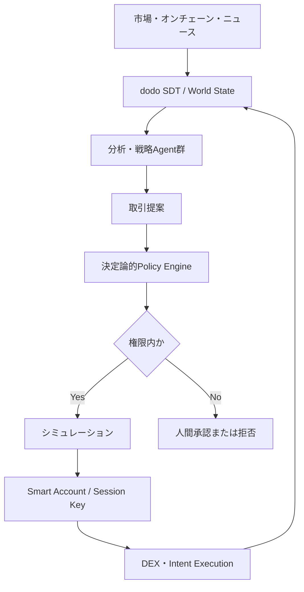
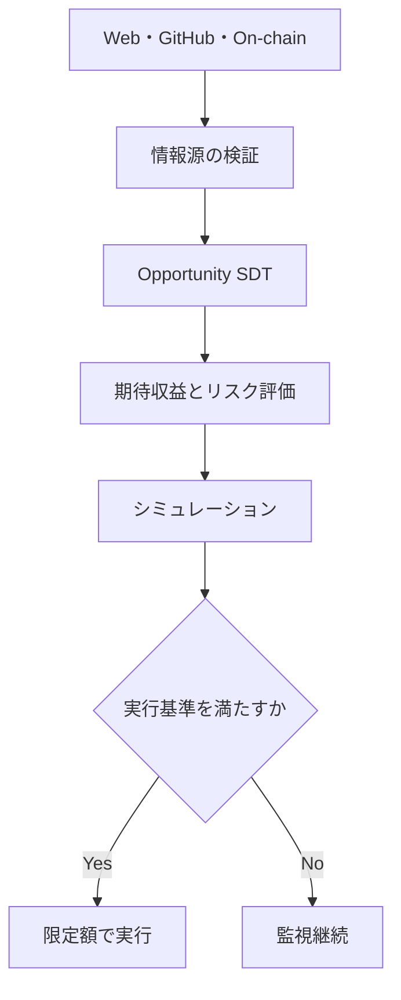

ドードーを使ってエージェンティックなクリプトの売買のアプリケーションを作ろうと思ってます。ドードーを使うんだったらどんなの作るべきか。ノンカストリアルでやります。

作るべきなのは、単なる「AIトレーディングボット」ではありません。

**ユーザーが資産ではなく、“制限された権限”だけをAIに委任する、自己主権型のエージェンティック投資OS**です。

仮称なら、**dodo Sovereign Trading**、**dodo Alpha OS**あたりです。

## プロダクトの核心

従来の自動売買は、

> 戦略を選ぶ → APIキーを渡す → ブラックボックスが売買する

です。

dodoAIで作るなら、

> 投資方針を自然言語で定義
> → 複数Agentが市場を分析
> → 売買案を作成
> → 決定論的なポリシーエンジンが検査
> → 許可範囲内だけウォレットが署名・執行
> → 判断根拠と結果をSDTに保存

にするべきです。

重要なのは、**AIに秘密鍵を渡さない**ことです。

AIが持つのは、例えば次のような期限付き・用途限定の権限です。

* 1日最大100万円
* BTC、ETH、USDCだけ
* 指定DEX・指定コントラクトだけ
* 最大スリッページ0.5%
* レバレッジ禁止
* 新規トークン購入禁止
* 損失が5%を超えたら停止
* 30日で権限失効
* 重大な取引だけ人間承認

つまり、ノンカストディアルというより、さらに一段進んだ、

> **Non-custodial, policy-custodied autonomy**

です。資産はユーザーが持ち、Agentは憲法に拘束されます。

## 最初に作るべきユースケース

私なら、個人向けの「爆益AI」ではなく、まず次を作ります。

### dodo Agentic Treasury

企業、DAO、ファミリーオフィス、クリプト保有法人向けの、自律型トレジャリー運用基盤です。

例：

> BTC 50%、ETH 30%、ステーブルコイン20%を基本構成とする。
> 乖離が5%以上になった場合のみリバランス。
> ステーブルコインのデペッグ兆候、プロトコルの脆弱性、流動性急減を検知したら新規取引停止。
> 1回500万円以上の取引はCFO承認。
> 月間損失8%で全Agentを停止。

これをAgentが24時間監視します。

* Market Agent：価格、ボラティリティ、流動性
* On-chain Agent：クジラ、資金流入出、コントラクト状態
* Research Agent：ニュース、ガバナンス、技術変更
* Risk Agent：VaR、ドローダウン、デペッグ、プロトコルリスク
* Strategy Agent：売買・リバランス案
* Red Agent：その取引が失敗する条件を攻撃的に検証
* Execution Agent：許可された取引だけ執行
* Auditor Agent：根拠・署名・結果を保存

複数Agentの多数決にはしません。最終的な可否は、LLMではなく**決定論的なポリシーエンジン**が判断します。

## dodoAIを使う意味

dodoAIの強みは「予測精度」ではなく、**Agentの統治と組織知**にあります。

| dodoAIの要素        | トレーディングでの役割                  |
| ---------------- | ---------------------------- |
| SDT              | 市場状態、ポートフォリオ、投資仮説、取引結果を構造化   |
| OODA             | 観測→分析→判断→執行の自律ループ            |
| DID/VC           | Agent、データソース、戦略、承認者の識別       |
| Agent Governance | 金額、銘柄、プロトコル、期限などの権限制御        |
| SBOM/MCP統制       | 利用モデル、ツール、外部データ、実行コードを追跡     |
| Red/Blue Agent   | 操作相場、プロンプトインジェクション、誤情報への耐性評価 |
| tamba/OI         | 投資委員会の判断、失敗、承認履歴を組織知化        |
| Desktop          | 秘密鍵や署名処理をユーザー環境に残す           |

これは「AIが次に上がるコインを当てる」プロダクトではなく、

> **投資委員会そのものをソフトウェア化する**

プロダクトです。

ここはdodoAIとの相性が非常にいい。

## 推奨アーキテクチャ

ウォレットはEOA直結より、まずEVM系のSmart Accountが適しています。

SafeのModule/Guardは、支出上限、ホワイトリスト、定期実行などを実装できます。ただしModuleは強い権限を持つため、監査済みの限定的なModuleにする必要があります。[Safe Modules公式ドキュメント](https://docs.safe.global/advanced/smart-account-modules)

執行は、最初からDEXを何十個も直接操作せず、CoW ProtocolのようなIntent型を使う方がよいです。条件付き注文、TWAP、利確、損切りなどをプログラム化できます。[CoW Protocol Programmatic Orders](https://docs.cow.fi/cow-protocol/concepts/order-types/programmatic-orders)

## LLMに絶対させてはいけないこと

* 生の秘密鍵を保持させる
* 任意のcalldataを生成・署名させる
* 未検証コントラクトを自由に呼ばせる
* 単一の価格オラクルだけで売買させる
* SNS投稿をそのまま売買シグナルにする
* Agent自身に権限上限を変更させる
* 「AIの確信度」だけでポジションサイズを決める

LLMは判断案を出しますが、執行は、

1. 許可済みAdapter
2. トランザクションデコード
3. 複数価格ソース照合
4. fork環境でシミュレーション
5. ポリシー検査
6. 署名

というパイプラインに固定します。

## MVP

最初のMVPはかなり絞れます。

* Ethereum/Base/Arbitrumのどれか1〜2チェーン
* BTCラップ資産、ETH、USDC程度
* Safe Smart Account
* リバランス
* DCA
* 損切り・利確
* ポートフォリオ上限
* プロトコル/トークンのAllowlist
* 取引前シミュレーション
* 人間承認モード
* 全判断のEvidence Ledger
* 緊急停止・権限失効
* バックテストとPaper Trading

最初から「完全自律売買」を売らず、次の3段階にします。

1. **Observe**：分析と提案だけ
2. **Approve**：人間承認後に執行
3. **Autopilot**：限定された範囲だけ自律執行

これならユーザーが徐々に信頼を増やせます。

## ビジネス上の差別化

勝ち筋は運用成績を競うことではありません。そこは大量のクオンツ、取引所、ファンドと正面衝突します。

dodoAIの防衛線は次です。

* 投資方針を機械実行可能なPolicyに変換
* Agentに与えた権限の完全な可視化
* 判断根拠と情報源の追跡
* 戦略バージョンごとの実績証明
* 組織内の承認・職務分掌
* 攻撃や誤情報に対するAgentセキュリティ
* ノンカストディアルなまま企業統制を実現

要するに、

> **Bloomberg＋投資委員会＋Safe＋自律Agent**

を一つにするイメージです。

## 規制面の重要点

「秘密鍵を預からないから無規制」とは考えない方がよいです。

日本では、暗号資産の売買だけでなく、その媒介・取次ぎ・代理も暗号資産交換業の対象になり得ます。[金融庁 FinTechサポートデスク](https://www.fsa.go.jp/news/27/sonota/20151214-2.html)

さらに2025年末の金融庁WGでは、暗号資産を金商法上の金融商品として扱う方向性がまとめられており、2026年は制度移行期です。[金融庁・暗号資産制度WG](https://www.fsa.go.jp/singi/singi_kinyu/angoshisanseido_wg/angoshisanseido_wg_index.html)

特に、

* 個別銘柄をAIが推奨する
* 有料で継続的な助言をする
* ユーザーのために注文をルーティングする
* 自動的にポートフォリオを変更する
* 成果報酬を受ける

は、ノンカストディアルでも助言・媒介・運用に該当する可能性があります。

したがって初期は、

* 法人自身の自己勘定を支援するSaaS
* ユーザーが定義したルールの機械的実行
* 実行前承認を標準設定
* 月額SaaS課金
* 成果報酬・スプレッド収益・不透明なルーティング報酬は避ける
* 登録済み事業者との提携も検討

が現実的です。

## 結論

dodoAIで作るなら、目指すべきは、

> **資産を預からず、ユーザーの投資憲法に従って、限定された権限だけで観測・判断・執行・監査するSovereign Agentic Treasury OS**

です。

最初は「当たるAI」ではなく、**暴走しないAI、説明できるAI、権限を奪えないAI**として出す。その上に、トレーディング戦略や外部Strategy Agentを載せられるマーケットプレイスを作るのが、dodoAIらしい拡張だと思います。

# まあエアドロップもエージェント使ってもらうことができるし、クローリングもできるし、あとはレンディングとか、まあそういうのも使いながら全体の資産形成っていうものができるんじゃないかなと思ってるんですね。でそういうのも含めて、かなりリスクもある。リスクもあるんだけど、まあそれらも含めてですね。どんなことができるのか。さらに、なんかその辺の戦略ってどうすんだろうね。普通にトレーディングをバンバン回しても、昔FXで負けたように負けると思ってんだよね。

その見立てが正しいです。**普通にAIへ価格予測させて売買回数を増やすと、手数料・スリッページ・ノイズ取引が増えて、昔のFX自動売買と同じ構造で負けやすい**。

dodoAIで狙うべきなのはトレーディングAIではなく、

> **オンチェーン上の資産形成機会を探索し、リスク調整して、限定権限で実行する「Crypto Wealth Agent」**

だと思います。

## どこにAgentの勝ち筋があるか

Agentの優位性が高い順に並べるとこうです。

| 収益源       | Agentとの相性 | 内容                           |
| --------- | --------: | ---------------------------- |
| オペレーショナルα |     非常に高い | 情報収集、期限管理、Claim、Revoke、資金移動  |
| インセンティブα  |        高い | エアドロップ、ポイント、報酬プログラム          |
| イールドα     |        高い | Lending、Staking、Restaking、LP |
| リスク回避α    |     非常に高い | デペッグ、脆弱性、流動性低下からの退避          |
| 執行α       |       中〜高 | DEX比較、TWAP、ガス・スリッページ最適化      |
| イベントα     |         中 | Governance、上場、Unlock、アップグレード |
| 価格予測α     |        低い | 短期売買、チャート予測、方向性ベット           |

**一番再現性が低い価格予測を主役にしない**ことが重要です。

むしろ、人間が面倒で継続できないことをAgentにやらせる。

* 毎日数百のプロトコルを巡回
* ガバナンスフォーラムやGitHub更新を監視
* 金利・報酬・TVL・流動性の変化を検知
* エアドロップ要件と期限を管理
* Claim可能になったら通知
* 不要なToken Approvalを解除
* 危険なプロトコルから退避
* 資産配分の乖離をリバランス
* 税務用に取得価格と取引理由を記録

この「地味だが大量にある作業」の集積が、Agentic Cryptoの本命です。

# dodo Crypto Wealth OS

プロダクトを5つのAgent領域に分けます。

## 1. Base Portfolio Agent

資産形成の土台です。

* BTC・ETHなどの定期購入
* 目標配分へのリバランス
* 急騰時の過剰エクスポージャー縮小
* ステーブルコイン比率管理
* チェーン・トークン・プロトコル集中度管理

ここは積極的に相場を当てません。

「BTCが上がると思うから買う」ではなく、

> BTC比率が目標40%に対して31%まで低下し、リバランス条件を満たした

という機械的な判断にします。

## 2. Yield Agent

遊休資産から、比較的説明可能な収益を得ます。

対象は段階的に広げます。

1. ステーキング
2. レンディングへのSupply
3. 流動性マイニング
4. LP
5. Borrowを使った戦略
6. デルタニュートラル・ベーシス取引

ただし、画面に表示されるAPYだけを比較してはいけません。

Agentが計算するのは、

[
期待純収益
=====

基礎金利
+報酬
+インセンティブ期待値
-ガス
-スリッページ
-ヘッジ費用
-税務コスト
-期待損失
]

です。

例えば20% APYでも、

* 報酬トークンの価格下落
* スマートコントラクト障害
* ブリッジ障害
* ステーブルコインのデペッグ
* 流動性不足
* 管理者権限
* オラクル操作

を入れると、実質的なリスク調整後収益がマイナスの場合があります。

Aaveも、コード脆弱性、トークン固有リスク、清算リスクなどを明示しています。借入を伴う場合、Health Factorが閾値を下回ると清算されるため、最初の製品では**Supplyのみ、Borrowなし**から始めるのがよいです。[Aave公式リスク説明](https://aave.com/docs/resources/risks)

LPも手数料収入だけ見てはいけません。インパーマネントロス、レンジ外、スマートコントラクト、トークン自体のリスクがあります。[Uniswap公式リスク説明](https://support.uniswap.org/hc/en-us/articles/37113550065549-What-are-the-risks-when-providing-liquidity)

## 3. Airdrop Agent

ここはAgentとの相性がかなりいいです。

できることは、

* 新規プロトコルの発見
* 資金調達、チーム、監査、GitHub活動の確認
* 公式ドキュメントとGovernanceのクロール
* エアドロップ可能性の推定
* Eligibility条件の構造化
* 必要なオンチェーン活動の計画
* ガス代を含む期待値計算
* 実行期限の管理
* Claim検知
* Claimトランザクションのシミュレーション
* Claim後の売却・保有判断
* 不要Approvalの解除

ただし、**大量ウォレットによるSybil farmingを主戦略にしない**方がよいです。

理由は、

* プロジェクト側の除外対象になる
* 利用規約上の問題
* 資金移動パターンから検出される
* ウォレット管理とガス負担が膨らむ
* dodoAIのブランドが毀損する

からです。

「100ウォレットで機械的に踏む」のではなく、

> ユーザーが本当に利用するプロトコルをAgentが発見し、正規利用を最適化し、取りこぼしなくClaimする

という設計が長期的には強いです。

## 4. Opportunity Agent

インターネットとオンチェーンを横断して、機会を探します。

監視対象は例えば、

* プロトコル公式ドキュメント
* Governance proposal
* Discord・X・ブログ
* GitHubのリリースとコミット
* スマートコントラクトのアップグレード
* TVL、出来高、利用率
* 金利曲線
* Token unlock
* Treasuryの移動
* ブリッジ流出入
* 大口ウォレット
* Stablecoin供給量
* CEXへの入出金
* 監査レポート
* 脆弱性情報

ただし、クロール結果をそのまま売買に接続しません。

情報ソースごとに信頼度を持たせます。

* 公式コントラクト
* 公式Governance
* 公式ドキュメント
* 監査会社
* オンチェーン実測
* 一次情報メディア
* SNS投稿
* インフルエンサー

を同じ重みで扱ってはいけません。

## 5. Guardian Agent

これは収益を生まないように見えますが、最も重要です。

* Stablecoinデペッグ検知
* Oracle異常
* TVL急減
* 大口流出
* Admin key変更
* Contract upgrade
* Governance攻撃
* Bridge停止
* Chain停止
* フロントエンド改ざん
* DNS乗っ取り
* Token approval異常
* ウォレットへの不審Token送付
* プロンプトインジェクション検出

異常を検知した場合は、

1. 新規取引停止
2. Agent権限停止
3. Approval解除
4. 安全資産への退避案作成
5. 人間へ緊急承認依頼

まで行います。

**損失を一度回避する価値は、細かいトレードで数年間稼ぐ利益より大きい**可能性があります。

# 資産形成戦略の構造

全資産を一つのAgentに渡してはいけません。役割別にWalletを分離します。

| Wallet  | 目的              |    自律度 |   例示配分 |
| ------- | --------------- | -----: | -----: |
| Vault   | 長期保有・保全         |   原則手動 | 60〜80% |
| Earn    | Lending・Staking | 制限付き自律 | 10〜25% |
| Explore | Airdrop・新規プロトコル |   少額自律 |  3〜10% |
| Trade   | イベント・価格戦略       |  厳格な上限 |   0〜5% |

これは推奨比率ではなく、製品上のテンプレートです。

重要なのは資金配分より**損失可能額の配分**です。例えば100万円をレンディングしていても、コントラクト障害時には100万円失う可能性がある。したがって、

* 投入額
* 平常時ボラティリティ
* 最大想定損失
* 流動性
* 相関
* 回収可能時間

を別々に管理します。

# FXのように負けないためのルール

## 1. デフォルトを「何もしない」にする

Agentは取引機会を探すのではなく、**取引しない理由を先に探す**べきです。

* 優位性が手数料の3倍未満なら取引しない
* 情報源の信頼度が足りなければ取引しない
* 流動性が薄ければ取引しない
* 既存ポジションとの相関が高ければ取引しない
* 説明可能な収益源がなければ取引しない

## 2. 売買回転数に上限を設ける

* 1日当たり取引回数
* 月間売買代金
* ガス予算
* スリッページ予算
* ポジション変更回数
* 同一戦略の再実行間隔

を制限します。

Agentは疲れませんが、**市場ノイズに反応し続ける**という別の弱点があります。

## 3. 戦略ごとに独立採算を見る

「ウォレット全体で増えた」だけでは不十分です。

* BTCを持っていただけならいくらだったか
* ステーブルで保持していたらどうだったか
* Agentが何もしなかった場合と比較してどうか
* 手数料・ガス・税務前後でどうか
* 最大ドローダウンはどうか

を常に比較します。

Agentの売買利益ではなく、

> **Agent介入による増分利益**

を測ります。

## 4. Canary運用する

新戦略は、

1. バックテスト
2. Paper Trading
3. 1万円相当
4. 10万円相当
5. 制限付き本番
6. 一定期間後に増額

と段階的に上げます。

過去データで好成績だから資金を一気に渡す、は避けます。

# dodoAIの本当の防衛線

このプロダクトの価値は「どの通貨が上がるか」ではありません。

dodoAIに蓄積されるのは、

* どんなOpportunityがあったか
* どの情報源が正しかったか
* なぜ投資したか
* どのリスクを見落としたか
* 実際の収益はどうだったか
* 何もしない方がよかったか
* どのAgent・モデル・戦略バージョンだったか

という**投資判断の組織知**です。

個人で使えばPersonal Investment Intelligence、企業やDAOで使えばOrganizational Investment Intelligenceになります。

したがってプロダクトの中心は「Trade画面」ではなく、

> **Opportunity Graph × Risk Engine × Policy Wallet × Evidence Ledger**

です。

## 最初の実装順

私なら次の順番です。

1. ウォレット資産・ポジションの統合表示
2. Opportunityのクロールと評価
3. リスク・危険検知
4. エアドロップ、Claim、期限管理
5. Lending・Staking比較
6. 人間承認による実行
7. 限定された自律実行
8. リバランス・DCA
9. LP・Borrow・デルタニュートラル
10. 最後に少額の方向性トレーディング

つまり、**トレーディングは最後**です。

一言でいえば、

> dodoAIは「AIに相場を当てさせるアプリ」ではなく、「オンチェーンに散在する資産形成機会を発見し、危険を避け、面倒な実行を積み重ねるAI資産形成OS」にするべきです。

この設計なら、エアドロップ・レンディング・ステーキング・LP・トレーディングがバラバラな機能ではなく、すべて一つの「リスク予算付きOpportunity Portfolio」として統合されます。
