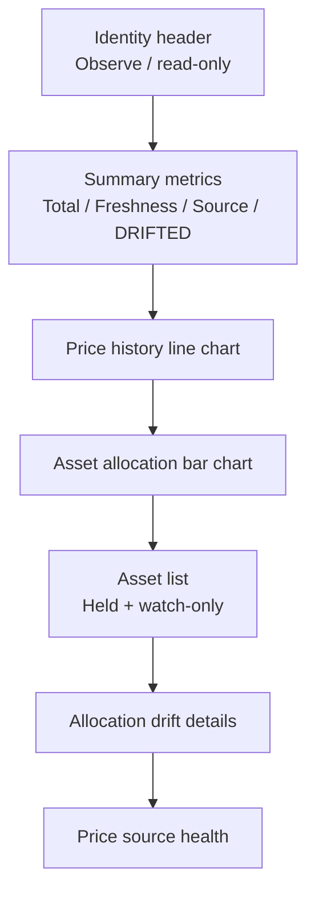

# ED16 — F-CRYPTO-PORTFOLIO-DASHBOARD 画面設計書

## 1. 画面基本情報

| 項目 | 内容 |
| --- | --- |
| 画面 ID | `SCR-CRYPTO-PORTFOLIO-001` |
| 画面名 | 資産・生存ダッシュボード |
| 画面種別 | Overview / read-only |
| URL | `/app/custom-ui/crypto-wealth/dashboard` |
| Manifest path | `dashboard` |
| アクセス | single-owner |
| Feature / EPIC | `F-CRYPTO-PORTFOLIO-DASHBOARD` / `EPIC-VIABILITY` |
| CAP | `CAP-ONCHAIN-OBSERVE`, `CAP-VIABILITY-EVAL`, `CAP-EVIDENCE-LEDGER` |
| JSON SoT | `screen-design.json` |
| ADF 正本 | ED16 `47-screen-design.md` |

## 2. 画面概要

本人の保有銘柄、現在評価額、価格推移、資産配分、観測品質を一画面で把握し、目標配分からの乖離が `DRIFTED` か判断する。

主な機能:

- 総資産評価額と観測鮮度を表示する。
- 保有銘柄と watch-only 銘柄を区別し、銘柄記号を常に表示する。
- 監視銘柄の価格履歴を line chart で表示する。
- 評価可能な保有銘柄の配分を bar chart で表示する。
- 複数価格ソースの乖離、degraded、alert を銘柄単位で表示する。
- 目標配分が設定済みの場合のみ `DRIFTED` を判定する。

制約:

- Stage 1 Observe。送金、署名、swap、approve は扱わない。
- 秘密鍵・シード・個人実値は repo / SDT / ログへ保存しない。
- 価格や Viability 閾値が無い場合にゼロ値を捏造しない。
- H2 未確定の Viability 数値は「未設定」と表示し、暫定値を置かない。

## 3. EPIC / CAP / FR トレーサビリティ

| 画面責務 | CAP | FR | UC | 受入条件 |
| --- | --- | --- | --- | --- |
| 保有銘柄・数量・評価額 | CAP-ONCHAIN-OBSERVE | FR-OBS-1 | UC-1, UC-3 | 銘柄記号を含む保有行が表示される |
| 現在価格・複数ソース乖離 | CAP-ONCHAIN-OBSERVE | FR-OBS-2 | UC-1, UC-2 | 価格、source 状態、乖離が銘柄別に表示される |
| 価格履歴グラフ | CAP-ONCHAIN-OBSERVE / CAP-EVIDENCE-LEDGER | FR-OBS-2, FR-EVD-1 | UC-2, UC-3 | 保存 Tick だけを時系列表示する |
| 配分と DRIFTED | CAP-VIABILITY-EVAL | FR-VIA-3 | UC-1 | target 未設定時は DRIFTED と判定しない |
| ED15/ED16 の双対 | CAP-EVIDENCE-LEDGER | FR-EVD-5 | A02 | MD と JSON が同じ Screen ID・要件を持つ |

## 4. 画面レイアウト

狭い画面では上記の順に 1 列へ積み、ページ全体に横スクロールを発生させない。Asset table 自体の列は必要に応じて内部スクロールまたは優先列表示へ縮退する。

## 5. 画面構成要素

### 5.1 Header

| 要素 | 仕様 |
| --- | --- |
| eyebrow | `CRYPTO WEALTH / OBSERVE` |
| title | `資産・生存ダッシュボード` |
| scope | `Personal / Local only / Read-only` |
| 禁止 | 開発基盤メトリクス、送金・swap・入金ボタンを表示しない |

### 5.2 Summary metrics

| 指標 | データ | 表示規則 |
| --- | --- | --- |
| 総資産 | `valuation.total_value_usd` | USD。評価不能なら `—`、`0.00` に丸めない |
| 観測鮮度 | `valuation.stale` + timestamps | `Fresh` / `Stale` と観測時刻を文字で表示 |
| 価格ソース | asset/source 集約状態 | `Healthy` / `Degraded` / `Alert` |
| 配分状態 | allocation drift 集約 | `On target` / `DRIFTED` / `Not configured` |

### 5.3 価格履歴グラフ

| 項目 | 仕様 |
| --- | --- |
| Block | `chart` |
| variant | `line` |
| Action | `personal.crypto_price_history` |
| X 軸 | `observed_at` |
| Y 軸 | USD price |
| Series | 銘柄記号（ETH / BTC / BNB 等、personal config 由来） |
| 期間 | 初期 24h、最大 96 point |
| 空状態 | `価格履歴がまだありません。価格 Tick を取得してください。` |
| 監査代替 | 同じ観測を行形式でも参照可能にする |

履歴 JSONL に存在する Fact だけを描画する。点が 0〜1 件の場合は折れ線を捏造しない。

### 5.4 資産配分グラフ

| 項目 | 仕様 |
| --- | --- |
| Block | `chart` |
| variant | `bar` |
| Action | `personal.crypto_portfolio_valuation` |
| X 軸 | `symbol` |
| Y 軸 | `value_usd` |
| 対象 | 評価額を持つ保有銘柄だけ |
| 除外 | watch-only かつ評価額 0 の行 |

### 5.5 銘柄一覧

| 列 | 型 | 必須 | 表示規則 |
| --- | --- | --- | --- |
| 銘柄 `symbol` | string | Yes | 価格・数量欠損時も必ず表示 |
| 名称 `name` | string | Yes | config の表示名 |
| 区分 `holding_state` | enum | Yes | `held` / `watch-only` |
| 保有量 `amount` | decimal text / null | held のみ | watch-only は `—`。0 と欠損を混同しない |
| 価格 `price_usd` | number / null | No | 欠損は `取得不可` |
| 24h `change_24h_pct` | number / null | No | 比較可能な 2 観測が無ければ `—` |
| 評価額 `value_usd` | number / null | No | 価格欠損なら `—`、0 を捏造しない |
| 構成比 `share` | number / null | No | 評価可能な total に対する比率 |
| 価格乖離 `divergence_pct` | number / null | No | 複数 source 成功時のみ |
| ソース `source_status` | enum | Yes | healthy / degraded / alert / unavailable |

並び順は held → watch-only、同一区分内は評価額降順、評価不能は末尾とする。

### 5.6 配分乖離

目標配分が personal config に存在するときだけ Target / Actual / Drift / DRIFTED を表示する。target が無い場合は `目標配分は未設定です。` と表示し、DRIFTED=false で正常扱いしない。

### 5.7 価格ソース状態

銘柄ごとに source 値、乖離率、degraded、alert を表示する。単一 source 成功は価格自体を隠さないが、必ず degraded とする。

## 6. Action 連携

| Data source | Action | 入力 | 必須出力 |
| --- | --- | --- | --- |
| `valuation` | `personal.crypto_portfolio_valuation` | `{}` | total_value_usd, by_asset, allocation_drift, stale |
| `price-tick` | `personal.crypto_price_tick` | `{persist:true}` | observed_at, ticks[] |
| `price-history` | `personal.crypto_price_history` | `{hours:24,max_points:96}` | series[], symbols[], rows[] |
| `asset-overview` | `personal.crypto_asset_overview` | `{}` | observed_at, assets[], stale |

`personal.crypto_price_history` と `personal.crypto_asset_overview` は、既存の FR-OBS-1/2 と FR-EVD-1 を実現する画面用 composition Action であり、新規 FR ではない。

## 7. 状態管理

| 状態 | 表示 |
| --- | --- |
| loading | Summary skeleton、chart frame、asset table loading |
| ready | Summary、2 chart、asset rows を表示 |
| empty-config | 設定案内。総資産 0 を表示しない |
| history-empty | 現在銘柄は表示し、履歴 chart だけ明示的空状態 |
| degraded-price | 対象銘柄を残し、degraded の文字表示 |
| stale | 最終値と timestamp を残し、Stale と表示 |
| error | 失敗 section だけ bounded error。他 section を消さない |

## 8. エラーハンドリング

| 条件 | メッセージ | 動作 |
| --- | --- | --- |
| 全価格 source 失敗 | `価格を取得できませんでした。` | 価格・評価額を捏造しない。直近値があれば Stale 表示 |
| 単一 source のみ成功 | `価格ソースが 1 系統のみです。` | degraded として価格を表示 |
| 履歴なし | `価格履歴がまだありません。価格 Tick を取得してください。` | 現在銘柄一覧は維持 |
| target 未設定 | `目標配分は未設定です。` | DRIFTED 判定を行わない |
| 一部銘柄のみ失敗 | 当該行を unavailable | 他の銘柄・chart を継続表示 |

## 9. アクセシビリティ

- Chart に可視 title と凡例を付け、同一データの表形式代替を持つ。
- 上昇・下落、正常・異常を色だけで表さず、符号・文字ラベルを併記する。
- 鮮度と source 状態を文字で読み上げ可能にする。
- Asset table は semantic header を使う。
- キーボード focus 順をレイアウトの読み順と一致させる。

## 10. テストシナリオ

| ID | 種別 | 前提 | 期待結果 |
| --- | --- | --- | --- |
| SCR-PORT-01 | 正常 | ETH held、BTC/BNB watch-only、2 source price | 3 銘柄を表示。ETH は数量/評価額、BTC/BNB は watch-only。保有を捏造しない |
| SCR-PORT-02 | 正常 | 保存 Tick が 2 件以上 | price history line chart と symbol legend を表示 |
| SCR-PORT-03 | 正常 | 評価可能な保有資産あり | allocation bar chart に保有銘柄だけ表示 |
| SCR-PORT-04 | 境界 | 履歴 0 件 | chart は空メッセージ、現在銘柄一覧は表示 |
| SCR-PORT-05 | 異常 | price source 1 系統失敗 | 対象銘柄を degraded 表示 |
| SCR-PORT-06 | 異常 | price unavailable | price/value は `—`、`0.00` を表示しない |
| SCR-PORT-07 | Responsive | 狭い viewport | section が読み順に積まれ、ページ横 overflow なし |
| SCR-PORT-08 | Accessibility | chart 表示 | 同じ観測がラベル付き行または表形式でも確認可能 |

## 11. Testnet 画面差分

`SCR-CRYPTO-TESTNET-001` は既存の `summary-hero + markdown` を維持する。localhost / chain_id 31337 の状態だけを表示し、mainnet/public testnet funding は拒否する。資産ダッシュボードの銘柄・graph 要件を testnet 画面へ重複実装しない。

## 12. 変更履歴

| 日付 | 版 | 内容 |
| --- | --- | --- |
| 2026-08-22 | 1.0.0 | ユーザー指摘を HIL として、銘柄一覧・価格履歴・資産配分を含む ED16 を新設 |
