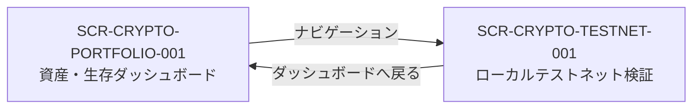

# ED15 — F-CRYPTO-PORTFOLIO-DASHBOARD 画面一覧

| 項目 | 値 |
| --- | --- |
| Feature | `F-CRYPTO-PORTFOLIO-DASHBOARD` |
| EPIC | `EPIC-VIABILITY` |
| CAP | `CAP-ONCHAIN-OBSERVE`, `CAP-VIABILITY-EVAL`, `CAP-EVIDENCE-LEDGER` |
| Product Form | Personal Custom UI / single-owner / local-first |
| 自律段階 | Stage 1 Observe（read-only） |
| JSON SoT | `screen-list.json` |
| ADF 正本 | ED15 `46-screen-list.md` |

## 1. 目的

本人が暗号資産の「何を保有しているか」「いくらか」「どう変化したか」「配分が意図から逸脱していないか」を迷わず判断できる画面群を定義する。送金・署名・swap・approve は本 Feature の画面責務に含めない。

## 2. 画面一覧

| 画面 ID | 画面名 | カテゴリー | 種別 | 役割 | Route | Access | 優先度 | UC / FR | 状態 |
| --- | --- | --- | --- | --- | --- | --- | --- | --- | --- |
| `SCR-CRYPTO-PORTFOLIO-001` | 資産・生存ダッシュボード | 資産観測 | Overview | 保有銘柄、評価額、価格履歴、資産配分、観測鮮度、DRIFTED を一画面で判断する | `/app/custom-ui/crypto-wealth/dashboard` | 本人のみ | P0 | UC-1/2/3; FR-OBS-1/2, FR-VIA-3, FR-EVD-1 | 実装待ち |
| `SCR-CRYPTO-TESTNET-001` | ローカルテストネット検証 | 開発検証 | Status | Anvil chain 31337 の稼働状態と検証手順を確認する | `/app/custom-ui/crypto-wealth/testnet` | 本人のみ | P1 | UC-4; FR gap は Feature に記録済み | 実装済み |

## 3. カテゴリー

### 資産観測

`EPIC-VIABILITY` の現在値を read-only で把握する。MVP の中心は `SCR-CRYPTO-PORTFOLIO-001` であり、Wallet・銘柄・グラフを別画面へ過度に分割しない。

### 開発検証

本番資産を使わず、観測 Action と画面配線をローカル Anvil で確認する。テストネット画面は資産判断画面と混在させない。

## 4. 画面遷移

## 5. アクセス権限

| ロール | アクセス可能画面 | 制約 |
| --- | --- | --- |
| single-owner | 全画面 | Personal scope。multi-user、組織承認、第三者向け公開を前提にしない |

## 6. 共通コンポーネント

| コンポーネント | 用途 | 根拠 |
| --- | --- | --- |
| `summary-hero` | 画面名と Observe/read-only 境界 | Custom UI block registry |
| `stat-card` | 総評価額・鮮度・ソース状態・DRIFTED の要約 | Custom UI block registry |
| `chart` | 価格履歴 line chart、資産配分 bar chart | Custom UI block registry |
| `data-table` | 保有/監視銘柄と複数ソース照合結果 | Custom UI block registry |
| `markdown` | ローカルテストネット操作ガイド | Custom UI block registry |

## 7. 要件トレーサビリティ

| 表示責務 | EPIC / CAP | FR | UC |
| --- | --- | --- | --- |
| 保有銘柄、数量、評価額 | EPIC-VIABILITY / CAP-ONCHAIN-OBSERVE | FR-OBS-1 | UC-1, UC-3 |
| 現在価格、複数ソース乖離、価格履歴 | EPIC-VIABILITY / CAP-ONCHAIN-OBSERVE | FR-OBS-2 | UC-1, UC-2 |
| 目標配分との乖離、DRIFTED | EPIC-VIABILITY / CAP-VIABILITY-EVAL | FR-VIA-3 | UC-1 |
| 履歴の追記保存と画面再現 | EPIC-VIABILITY / CAP-EVIDENCE-LEDGER | FR-EVD-1 | UC-2, UC-3 |
| ED15/ED16 の機械可読対 | EPIC-VIABILITY / CAP-EVIDENCE-LEDGER | FR-EVD-5 | A02 Gate |

## 8. MVP 境界

- ダッシュボードで銘柄記号を必ず表示する。保有銘柄と watch-only 銘柄を区別する。
- 価格履歴グラフと資産配分グラフを表示する。履歴不足をゼロ値として描画しない。
- 銘柄別詳細ページ、売買導線、NFT、Approval 操作は今回追加しない。
- Viability Policy の正本値が未確定な項目は数値を捏造せず「未設定」と表示する。

## 9. 変更履歴

| 日付 | 版 | 内容 |
| --- | --- | --- |
| 2026-08-22 | 1.0.0 | ユーザー指摘を HIL として、承認済み EPIC/CAP/FR に基づく ED15 を新設 |
